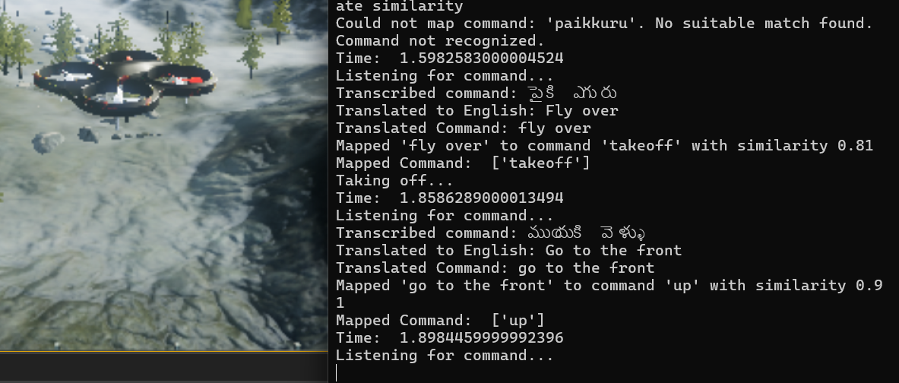
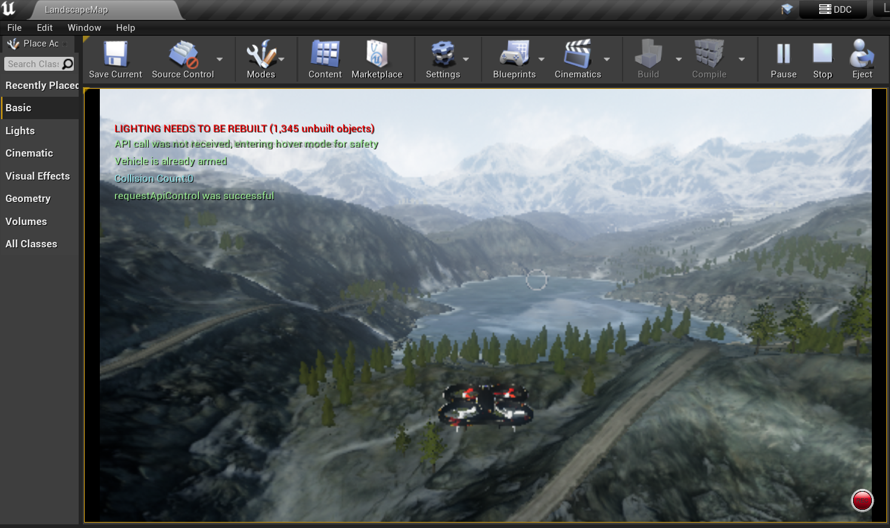
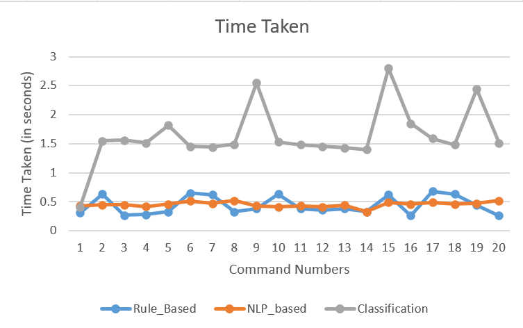

# 🚁 MultiLingual Drone Voice Control

This repository contains the implementation of a **multi-lingual voice-controlled drone system** built using **Microsoft AirSim**, **Unreal Engine**, and **Python**.  

The project demonstrates **three different approaches** to drone control:  
- **Rule-based**  
- **NLU-based**  
- **Zero-shot-classification-based**  

It supports a wide range of languages for voice commands, making drone technology more accessible to diverse communities.

---

## 📑 Table of Contents

- [Introduction](#introduction)
- [Features](#features)
- [Approaches](#approaches)
  - [Rule-based Control](#-rule-based-control)
  - [NLU-based Control](#-nlu-based-control)
  - [Zero-shot Classification Control](#-zero-shot-classification-control)
- [Setup Instructions](#setup-instructions)
- [Run the Code](#run-the-code)
- [Screenshots](#screenshots)
- [Software and Libraries Used](#software-and-libraries-used)
- [Supported Languages](#supported-languages)
- [System Specifications](#system-specifications)
- [Contributing](#contributing)

---

## 📝 Introduction

This project aims to simplify drone control by enabling **multi-lingual voice commands**.  
By leveraging **Automatic Speech Recognition (ASR)** (Google Web Speech API) and **Natural Language Processing (NLP)**, the drone interprets and executes commands in multiple languages.  

Target users include:  
- Farmers 🌾  
- Disaster response teams 🚑  
- Local communities 🌍  

Providing them with an **intuitive and accessible way to control drones**.

---

## ✨ Features

- **Multi-lingual Voice Support** → Commands in multiple languages using Google Speech API.  
- **Three Control Mechanisms:**  
  - ✅ Rule-based → predefined mappings.  
  - ✅ NLU-based → contextual understanding.  
  - ✅ Zero-shot classification → dynamic command recognition.  
- **Simulation Environment** → Built and tested in Microsoft **AirSim** with **Unreal Engine**.  

---

## ⚙️ Approaches

### 🔹 Rule-based Control
- **File:** `ruleBasedControl.py`  
- Matches commands to predefined synonyms mapped to drone actions.  
- Example: `"Fly up"`, `"Ascend"`, `"Go higher"` → same action.  
- ✅ Simple and effective for predictable command sets.

---

### 🔹 NLU-based Control
- **File:** `nluBasedControl.py`  
- Uses **SpaCy** for parsing and semantic understanding.  
- ✅ More flexible than rule-based.  

---

### 🔹 Zero-shot Classification Control
- **File:** `zeroBasedControl.py`  
- Uses **Facebook's Zero-shot Model** → `facebook/bart-large-mnli`.  
- ✅ Handles unexpected / novel commands dynamically.  

---

## 🛠 Setup Instructions

### 1. Install Required Software
- [Microsoft AirSim](https://github.com/Microsoft/AirSim)  
- Unreal Engine **4.27**  
- [Anaconda](https://www.anaconda.com/)  
- Visual Studio (**⚠️ NOT Visual Studio Code**)  

---

### 2. Clone AirSim Repository
```bash
git clone https://github.com/Microsoft/AirSim.git
```

### 3. Set Up Unreal Engine Environment

Follow the instructions on the [AirSim Build Documentation](https://microsoft.github.io/AirSim/build_windows/).

### 4. Install Python Dependencies

Create a Python environment using Anaconda and install the required libraries:

```bash
conda create -n airsim_env python=3.8
conda activate airsim_env
pip install spacy transformers SpeechRecognition
```

### 5. Set Up AirSim Simulation

- Use the `Landscape Mountains` project for the 3D simulation environment.
- Ensure proper connection between Unreal Engine and AirSim using Visual Studio.

### 6. Run the Code

Locate the project in Unreal Projects folder . Open Landscape.soln ( Visual Studio file ) .Press F5 (This starts Unreal Engine along with AirSim).
Now, just press Play button and the drone seems to spwan at the Player Start point .
Open Anaconda Prompt , Activate the created environment(here airsim_env) .
Navigate to `AirSim/PythonClient/multirotor` , paste the given python codes instead of hello_drone.py (sample code given my Airsim) and execute one of the control scripts(Rule_Based, NLP Based, Zero-Shot).

Follow these steps to run the drone control scripts:

**a. Launch Unreal Engine with AirSim**:

- Locate the project in the Unreal Projects folder
- Open `Landscape.sln` in Visual Studio
- Press `F5` to start Unreal Engine with AirSim
- Press the Play button to spawn the drone at the Player Start point

**b. Prepare Python Environment**:

- Open Anaconda Prompt
- Activate the created environment:
  ```bash
  conda activate airsim_env
  ```

**c. Navigate and Execute Control Scripts**:

- Navigate to the project directory:
  ```bash
  cd AirSim/PythonClient/multirotor
  ```
- Replace the default `hello_drone.py` with one of the provided control scripts:

```bash
python ruleBasedControl.py
python nluBasedControl.py
python zeroBasedControl.py
```

---

## Screenshots








## Software and Libraries Used

### Software

- Microsoft AirSim
- Unreal Engine 4.27
- Anaconda
- Visual Studio (NOT Visual Studio Code)

### Libraries

- AirSim Python API
- SpaCy
- SpeechRecognition (Google Speech Recognition API)
- Transformers (`facebook/bart-large-mnli`)

---

## Supported Languages

The project supports voice commands in many languages. Here are the language codes :

- Arabic (`ar`)
- Englisg (`en`)


---

## System Specifications

- **Operating System:** Windows 11
- **Laptop:** DEll Lenovo
- **Processor:** Intel Core i7 (12th Gen)
- **GPU:** NVIDIA RTX 3050
- **RAM:** 16 GB

---

## Contributing

Contributions are welcome! Please fork this repository and submit a pull request with your changes.


---

Feel free to reach out if you have any questions or suggestions. Happy flying!
